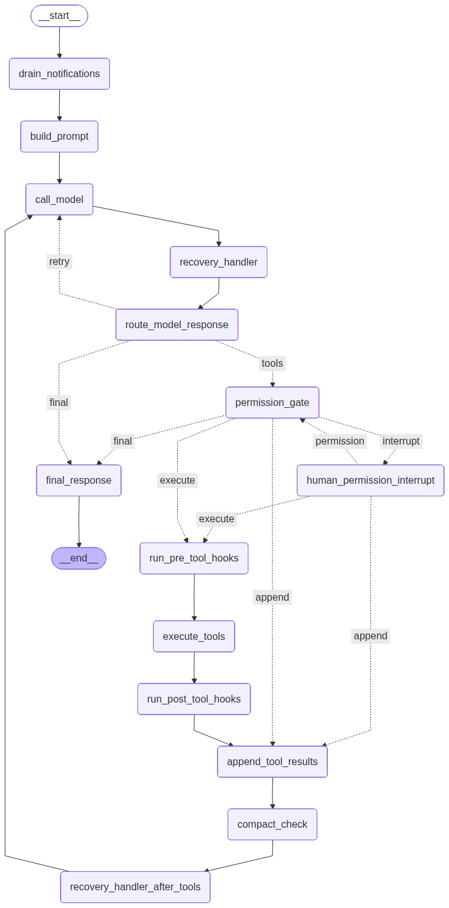

# StateGraph Structure

[中文](../zh-CN/stategraph-structure.md)

This document describes the main LangGraph graph implemented in `graph_code.agent.graph.build_agent()`. It is the authoritative map for the agent loop, routing decisions, interrupt/resume behavior, and tool-result message flow.

## Source Files

- `graph_code/agent/graph.py`: builds and compiles the `StateGraph`.
- `graph_code/agent/state.py`: defines `AgentState`.
- `graph_code/agent/nodes.py`: implements graph nodes and route functions.
- `graph_code/main.py`: drives `graph.stream(...)` and `Command(resume=...)` from the CLI.

## State Type

The graph is declared as:

```python
workflow = StateGraph(AgentState)
```

`AgentState.messages` uses LangGraph's `add_messages` reducer. This keeps assistant tool calls and matching `ToolMessage` results in the message history without manual duplication.

The rest of `AgentState` is control-plane state:

```text
messages
turn_count
transition_reason
pending_tool_calls
approved_tool_calls
pending_permission_request
tool_results
planning_state
compact_state
recovery_state
loaded_skills
notifications
runtime_tasks
current_task_id
teammate_identity
worktree_context
mcp_connection_state
```

Compatibility fields such as `tool_calls`, `iteration_count`, `pending_question`, `pending_confirmation`, `final_response`, and `error` are kept for the existing public API and tests.

## Compile-Time Dependencies

The graph is compiled with both a checkpointer and store:

```python
workflow.compile(
    checkpointer=checkpointer or _default_checkpointer(cfg),
    store=store or _default_store(cfg),
)
```

The development default is memory-backed persistence. Non-memory backends are created through `graph_code.agent.persistence`, leaving SQLite/Postgres paths behind configuration.

Every invoke/stream/resume path must pass a thread id:

```python
{"configurable": {"thread_id": thread_id}}
```

LangGraph uses this id to resume the same checkpoint after interrupts.

## Node Inventory

| Node | Function | Responsibility |
| --- | --- | --- |
| `drain_notifications` | `drain_notifications` | Marks queued notifications before prompt/model work. |
| `build_prompt` | `build_prompt` | Prompt assembly hook; current implementation records `prompt_built`. |
| `call_model` | `call_model_node` -> `call_model` | Calls the configured chat model, validates tool-message protocol, or reuses pending tool calls. |
| `recovery_handler` | `recovery_handler` | Handles model errors and transient retry routing before model response routing. |
| `route_model_response` | `lambda state: {}` | Empty node used as a named routing point after recovery. |
| `permission_gate` | `permission_gate_node` -> `permission_gate` | Evaluates permissions and creates permission requests, denied envelopes, or executable calls. |
| `human_permission_interrupt` | `human_permission_interrupt` | Calls LangGraph `interrupt()` and converts resume payloads into approved/denied tool state. |
| `run_pre_tool_hooks` | `run_pre_tool_hooks` | Pre-tool hook point. |
| `execute_tools` | `execute_tools_node` -> `execute_tools` | Runs approved tool calls through `ToolExecutionRuntime`. |
| `run_post_tool_hooks` | `run_post_tool_hooks` | Post-tool hook point. |
| `append_tool_results` | `append_tool_results` | Converts `ToolResultEnvelope` records into `ToolMessage` objects. |
| `compact_check` | `compact_check` | Performs summary compaction when message history crosses the threshold. |
| `recovery_handler_after_tools` | `recovery_handler` | Recovery hook after tool messages are appended and compaction runs. |
| `final_response` | `final_response` | Produces the final user-visible response and ends the graph. |

## Graph Topology



The PNG above is generated from the compiled LangGraph object, not drawn by hand. Regenerate both the Mermaid source and PNG with:

```bash
python -m graph_code.utils.export_graph_diagram --png
```

The exact Mermaid source produced by `build_agent().get_graph().draw_mermaid()` is stored in [`stategraph-topology.mmd`](../assets/stategraph-topology.mmd).

## Route Functions

### `route_model_response`

Runs after `recovery_handler`.

| Return | Next node | Meaning |
| --- | --- | --- |
| `retry` | `call_model` | A transient model/API error was recovered and should be retried within budget. |
| `tools` | `permission_gate` | The model produced tool calls or pending tool calls already exist. |
| `final` | `final_response` | The model produced normal content or an unrecoverable error exists. |

### `route_permission`

Runs after `permission_gate`.

| Return | Next node | Meaning |
| --- | --- | --- |
| `interrupt` | `human_permission_interrupt` | At least one tool call requires human approval. |
| `execute` | `run_pre_tool_hooks` | Tool calls are allowed or already approved. |
| `append` | `append_tool_results` | Only denied tool results need to be returned to the model. |
| `final` | `final_response` | No tool work remains. |

### `route_after_human_permission`

Runs after the graph resumes from `interrupt()`.

| Return | Next node | Meaning |
| --- | --- | --- |
| `permission` | `permission_gate` | More pending tool calls remain and must be checked separately. |
| `execute` | `run_pre_tool_hooks` | Approved calls are ready to run. |
| `append` | `append_tool_results` | Only denied tool results need to be appended. |

This route prevents one approval from authorizing every side-effecting tool in the same model response.

## Main Execution Paths

### 1. Direct Final Response

```text
START
  -> drain_notifications
  -> build_prompt
  -> call_model
  -> recovery_handler
  -> route_model_response(final)
  -> final_response
  -> END
```

### 2. Tool Call Without Human Approval

Read-only tools and auto-approved tools follow:

```text
call_model
  -> route_model_response(tools)
  -> permission_gate(execute)
  -> run_pre_tool_hooks
  -> execute_tools
  -> run_post_tool_hooks
  -> append_tool_results
  -> compact_check
  -> recovery_handler_after_tools
  -> call_model
```

The second `call_model` sees the original assistant tool call plus matching `ToolMessage` entries and can produce a final response or request more tools.

### 3. Tool Call With Human Approval

Side-effecting tools in `default` or `plan` mode use LangGraph interrupts:

```text
permission_gate(interrupt)
  -> human_permission_interrupt
      interrupt(permission_request)
      Command(resume={"approved": true})
  -> route_after_human_permission
```

Approved tool calls are stored in `approved_tool_calls`. If more pending tool calls remain, the graph routes back to `permission_gate` so each risky tool is checked independently. When no more approvals are needed, approved calls move to `execute_tools`.

### 4. Tool Denial

If the user denies a permission request, `human_permission_interrupt` creates a normal error `ToolResultEnvelope` for that specific `tool_call_id`.

Denied results do not crash the graph. They are appended as `ToolMessage` objects so the model receives a valid response for the denied tool call.

### 5. Transient Model Retry

When `call_model` catches a transient API/network error, it stores:

```text
error = "...provider error..."
transition_reason = "model_error"
```

`recovery_handler` checks `recovery_state["transient_retry_budget"]`. If budget remains, it clears `error`, decrements the budget, writes `transition_reason = "transient_model_retry"`, and `route_model_response` routes back to `call_model`.

### 6. Context Compaction Loop

After tool results are appended, `compact_check` may summarize long history. The graph then passes through `recovery_handler_after_tools` and returns to `call_model`.

## Interrupt Payloads

`permission_gate` creates `pending_permission_request` using:

```python
build_permission_request(tool_call, decision)
```

The request contains:

```text
tool_call
tool_call_id
tool_name
args
reason
risk
```

`human_permission_interrupt` pauses with:

```python
resume = interrupt(request)
```

The CLI resumes with:

```python
Command(resume={"approved": True})
Command(resume={"approved": False, "reason": "..."})
```

## Message Protocol Invariants

The graph must preserve OpenAI-compatible tool-call message order:

```text
AIMessage(tool_calls=[call_1, call_2])
ToolMessage(tool_call_id=call_1.id)
ToolMessage(tool_call_id=call_2.id)
```

`call_model` validates this before hitting the provider. If the local history is invalid, the graph returns `transition_reason = "message_protocol_error"` instead of sending a request that would fail with a provider-side 400.

`append_tool_results` is the only graph node that writes tool results back into `messages`. It converts each `ToolResultEnvelope` into a `ToolMessage`.

## Tool Result Ordering

`execute_tools` merges newly executed results with pre-existing denied results and sorts them according to the latest assistant tool-call order. This keeps tool results stable even when some calls are denied and others are executed.

`ToolExecutionRuntime` preserves execution semantics:

- Consecutive read-only calls may run concurrently.
- A write/bash/worktree call flushes pending reads before it executes.
- Returned results keep the original tool-call order.

## CLI Streaming Behavior

The CLI uses `graph.stream(..., stream_mode="updates")`.

For normal user turns:

```python
run_agent(user_input, state, thread_id)
```

For interrupted turns:

```python
resume_graph(resume_value, thread_id, state=state)
```

The runner synchronizes streamed state updates back into the caller-held `state` with `_sync_state_update`. This is required because the CLI keeps a local state object across turns while LangGraph also stores checkpointed state.

The CLI renders progress for long phases:

- permission approved or denied
- tool execution completed
- transient model retry

This avoids the apparent hang where a tool has finished but the graph is waiting on the next model call.

## Turn Preparation

Each new sync or async turn calls `_prepare_turn_state` before streaming:

```text
final_response = None
error = None
pending_question = False
pending_confirmation = False
pending_tool_calls = []
approved_tool_calls = []
tool_calls = []
tool_results = []
messages += HumanMessage(user_input)
```

This keeps `run_agent` and `run_agent_async` behavior aligned and prevents stale per-turn state from leaking into the next request.

## Design Invariants

- The graph runtime is LangGraph's `StateGraph`; this project does not reimplement checkpointing, interrupt, or streaming runtime behavior.
- Every user turn and resume path supplies `thread_id`.
- Human approval is implemented with LangGraph `interrupt()` and `Command(resume=...)`.
- Side-effecting tools are never authorized as a group by a single approval.
- Denied tools produce normal `ToolResultEnvelope` records.
- Tool results are appended as `ToolMessage` objects before the next model call.
- Transient model retries are budgeted to avoid infinite loops.
- CLI-held state is synchronized from streamed graph updates.

## Tests Covering This Graph

Useful regression tests:

- `tests/test_agent_graph.py`
- `tests/test_claude_code_agent_requirements.py`
- `tests/test_graph_diagram_export.py`
- `tests/test_integration_multi_turn.py`
- `tests/test_main_cli.py`
- `tests/test_message_protocol.py`
- `tests/test_recovery.py`

These tests cover stream state sync, permission interrupts/resume, multiple side-effect approvals, tool result ordering, message protocol validation, transient retry, CLI progress rendering, and LangGraph-generated diagram synchronization.
